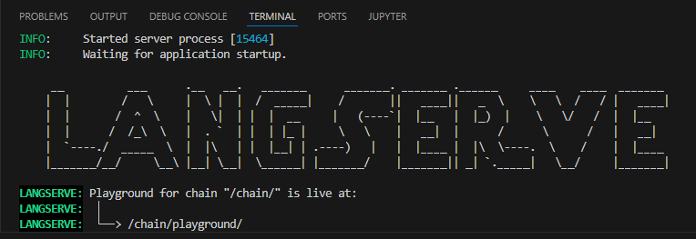
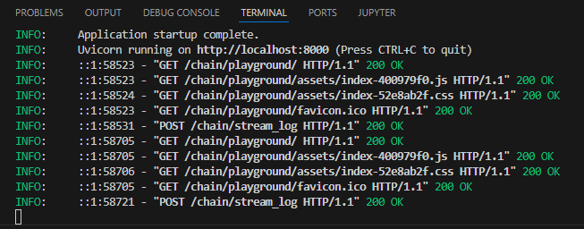
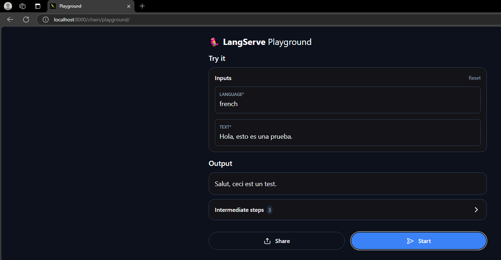

# AREP LAB8: INTRODUCTION TO CREATING RAGS (RETRIEVAL-AUGMENTED GENERATORS) WITH OPENAI

The first part was completed where we followed the tutorial to create an LLM application with LCEL.

## Prerequisites

Make sure to have the following tools installed to run this project:

1. **Python (version 3.8 or higher)**
   - Download it from [python.org](https://www.python.org/downloads/).

2. **Git**
   - Download it from [git-scm.com](https://git-scm.com/downloads).

## Installation and Local Setup

### Clone the repository

Clone the repository to your local machine:

```bash
    git clone https://github.com/JuanDavidGarciaPulido/AREP_LAB8.git
    cd AREP_LAB8
```

### Running 

To run the service, follow these steps:

1. **Execute all commands in the Jupyter Notebook** following the tutorial and ensure the OpenAI API key is set to a valid one.

2. **Start the server** 

   ```bash
   python langchainserver.py
   ```

You should see an output similar to:






3. **Access the page** [http://localhost:8000/chain/playground/]

This page allows you to define a language and a phrase to be translated into that language.


   

# Architecture

* **Client (langchainclient.py):** Sends an HTTP request to the FastAPI server.
* **Server (langchainserver.py):** Processes the request using the LangChain model and parser.
* **Model (ChatOpenAI):** Performs the requested task, such as translating text.
* **Response:** The server returns the processed response to the client.

# Architecture Components

## LangChain App

Acts as an interactive environment for experimenting with LangChain.

* Installation and configuration.
* Interaction with the model.
* Model invocation.
* Creation of a pipeline (Chain).

## LangChain Server

Configures a FastAPI server that receives HTTP requests and executes the pipeline.

* Configuration of variables, templates, and the model.
* Creation of a REST API using FastAPI.
* Definition of a `/chain` endpoint that allows clients to invoke the chain.
* Running the server with Uvicorn.

## LangChain Client

Responsible for interacting with the FastAPI server.

* Creates a `RemoteRunnable` object pointing to the server's endpoint (http://localhost:8000/chain/).
* The pipeline is invoked with a JSON object containing the necessary parameters for the model.
* The server processes the request and returns the translated result.

# Link to the repository with part 2:

# [https://github.com/JuanDavidGarciaPulido/AREP_LAB8_PARTE2](https://github.com/JuanDavidGarciaPulido/AREP_LAB8_PARTE2)
